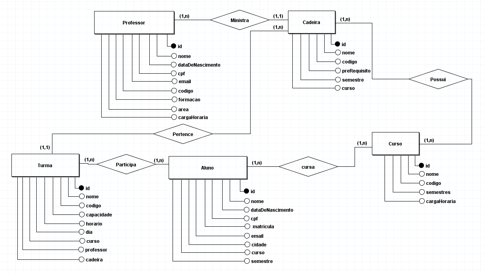

O sistema possui a finalidade de reduzir a demanda existente no gerenciamento acadêmico de estudantes da educação do ensino de nível superior. 
O sistema é baseado em uma aplicação já existente, o Sistema Integrado de Gestão de Atividades Acadêmicas, o SIGAA. O sistema possuirá as seguintes tabelas: aluno, curso, cadeira, turma e professor.

---
**Requisitos funcionais:**
- o sistema deve permitir o cadastro de novos alunos;
- o sistema deve permitir a exclusão de alunos;
- o sistema deve permitir a alteração de dados dos alunos;
- o sistema deve permitir o cadastro de novos professores;
- o sistema deve permitir a exclusão de professores;
- o sistema deve permitir a alteração de dados de professores;
- o sistema deve permitir o cadastro de novas cadeiras;
- o sistema deve permitir a exclusão de cadeiras;
- o sistema deve permitir a alteração de dados das cadeiras;
- o sistema deve permitir o cadastro de novos cursos;
- o sistema deve permitir a exclusão de cursos;
- o sistema deve permitir a alteração de dados dos cursos;
- o sistema deve permitir o cadastro de novas turmas;
- o sistema deve permitir a exclusão de turmas;
- o sistema deve permitir a alteração de dados das turmas;
- o sistema não pode permitir a matricula de cadeiras que possuem horários conflitantes;
- o sistema deve delimitar uma quantidade mínima e máxima de cadeiras que um aluno pode cursar;
- o sistema deve delimitar uma quantidade mínima e máxima de cadeiras que um professor pode ministrar;
---
**Requisitos não funcionais:**
- o sistema será desenvolvido pela aplicação SQLServer, com a linguagem SQL;
---
**Modelo de domínio:**
-	o sistema deve permitir o cadastro de um aluno com um número de matrícula único;
- o sistema deve permitir o cadastro de um professor com um código único;
- o sistema deve permitir o cadastro de uma turma com um código único;
- o sistema deve permitir o cadastro de um curso com um código único;
- o sistema deve permitir o cadastro de uma cadeira com um código único;
- um aluno pode estar associado a vários cursos, mas apenas uma associação por curso;
- um aluno pode estar associado a várias cadeiras, mas apenas uma associação por cadeira;
- um aluno pode estar associado a várias turmas, mas apenas uma associação por turma;
- um aluno não pode se matricular em cadeiras com horários conflitantes;
- um professor pode estar associado a várias cadeiras, mas apenas uma associação por cadeira;
- os campos nome, cpf, data de nascimento e e-mail são de caráter obrigatório para alunos e professores;
---
**Lista de componentes:**
- **tabela aluno** – armazenará as informações dos estudantes, dentre elas: nome, data de nascimento, cpf, matricula, curso, semestre etc;
- **tabela professor** – armazenará informações dos docentes, dentre elas: nome, data de nascimento, cpf, formação, carga horário etc;
- **tabela cadeira** – armazenará as informações das disciplinas de cada curso, dentre elas: nome, código, pré-requisitos etc;
- **tabela turma** – armazenará as informações de cada turma, dentre elas: nome, capacidade, horário, professor etc;
- **tabela curso** – armazenará as informações de cada curso, dentre elas: nome, semestres, carga horária etc;
- **triggers**:
    - tabela turma – definirá a capacidade máxima de alunos matriculados;
    - tabela cadeira – definirá apenas um professor como ministrante;
---
**Diagrama entidade-relacionamento**

---
**Diagrama lógico:**

---